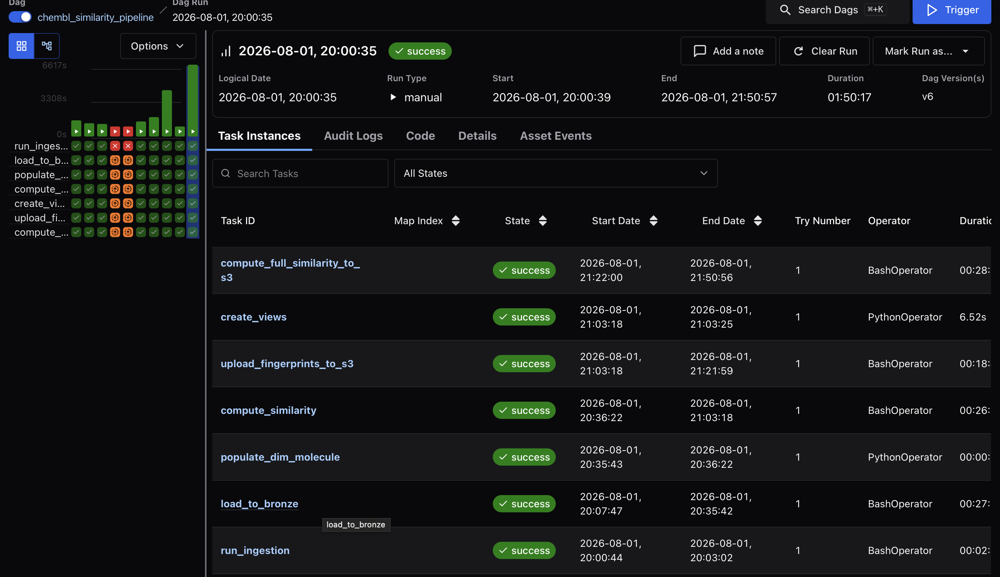
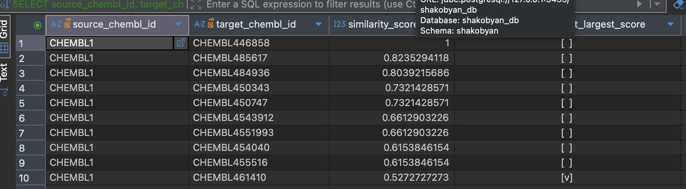
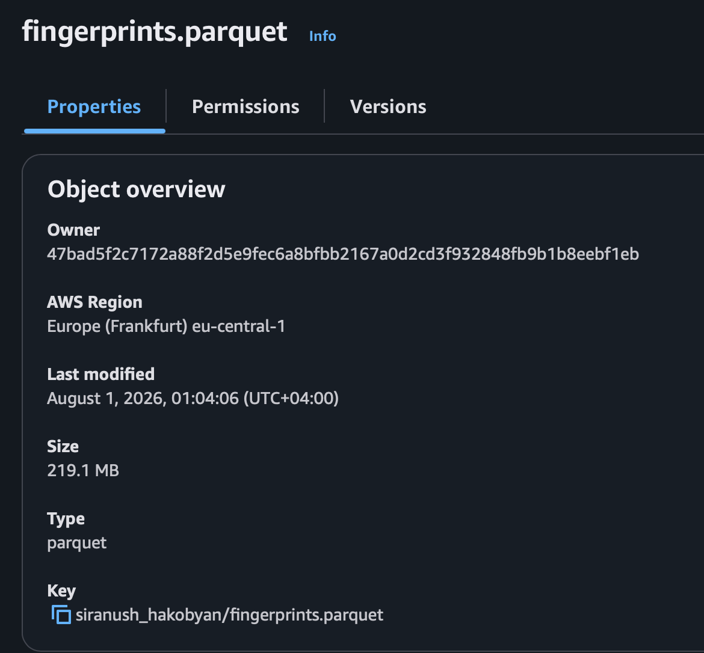

# similar_molecules_pipeline

A data pipeline I built that finds the 10 most similar molecules for 100 chosen source molecules, using real ChEMBL pharmaceutical data (~2.9 million molecules). Built for the DE School 2026 final project.

## What this project does

1. Downloads chemical data from ChEMBL (molecule info, structures, properties)
2. Turns each molecule's structure into a "fingerprint" (a way computers compare molecule shapes)
3. Compares 100 chosen molecules against all ~2.9 million ChEMBL molecules to find the most similar ones
4. Stores everything in a proper data warehouse (Postgres) and in S3
5. Runs the whole thing automatically every time using Apache Airflow
6. Sends an alert to Microsoft Teams if anything fails

## Architecture

```
ChEMBL (via chembl_downloader)
        ↓
   ingestion.py  →  parquet files (local)
        ↓
   load_to_bronze.py  →  Postgres "bronze" schema (raw data)
        ↓
   populate_dim_molecule.sql + compute_similarity.py
        ↓
   Postgres "gold" schema (dim_molecule + fact_similarity)
        ↓
   SQL views (5 required views)
        ↓
   S3 (fingerprints + full similarity tables)
```

Everything is orchestrated by one Airflow DAG running in Docker. As of August 2026, I've verified every task in this DAG succeeds for real, end-to-end, with nothing manually marked as complete.

## Why 2 layers, not 3 (medallion: bronze → gold, no silver)

The assignment lets me choose the number of layers as long as I justify it. I went with:

- **bronze** — raw data, loaded straight from ChEMBL with no changes
- **gold** — the finished data mart (molecule dimension table + similarity fact table + views)

I skipped a silver (cleaning) layer because ChEMBL data is already clean and well-structured — there was no messy data that needed a separate cleaning step. Adding a silver layer would only have added extra tables without solving a real problem.

## Why chembl_downloader instead of the ChEMBL REST API

The task says to pull data "from the ChEMBL web service." I used the `chembl_downloader` Python package instead, which downloads the same ChEMBL data as a complete SQLite database rather than making one API call per record.

My reasoning: pulling ~2.9 million individual records through a REST API, one request at a time, would be extremely slow and put unnecessary load on ChEMBL's public API. `chembl_downloader` gives the exact same underlying data, downloaded once and then queried locally — this is a standard, accepted approach for working with ChEMBL at this scale.

## Missing columns: cs_logp and molecular_species

Task 6a asks for these two columns, but they were removed from ChEMBL as of release 37 (the version I'm using). I kept both columns in the `gold.dim_molecule` table structure, but their values are `NULL` for every row. This is a data-source limitation, not a bug — the columns simply don't exist upstream anymore.

## Running on an 8GB Mac: the engineering problems I found and fixed

I built and ran this entire project on a MacBook with only 8GB of RAM. That's a real, tight constraint for a pipeline touching ~2.9 million molecules, and it surfaced several genuine problems along the way. I root-caused and properly fixed each one rather than working around it.

### Problem 1: Running out of memory (the original OOM)

**The problem:** Loading all ~2.9 million molecules into memory at once (to fingerprint them, or to load them into Postgres) crashed with an out-of-memory error, even after I raised Docker's memory limit to 6GB.

**My fix:** Instead of loading everything into memory at once, I now process and immediately save each part of the data to disk (or the database) before moving to the next part, freeing memory as I go:

- `run_ingestion`: fetches one table, saves it to a file, deletes it from memory, then moves to the next table
- `load_to_bronze`: reads and loads data in batches (1,000,000 rows at a time for most tables) instead of building one giant file in memory

**Result:** Both tasks now run successfully inside Docker at full scale, and I verified all four tables have the exact correct row counts:

| Table | Rows |
|---|---|
| chembl_id_lookup | 5,478,952 |
| molecule_dictionary | 2,921,148 |
| compound_properties | 2,901,464 |
| compound_structures | 2,897,819 |

### Problem 2: Silent stalls over the database tunnel

**The problem:** I connect to Postgres through an AWS SSM tunnel. Sometimes that tunnel would quietly drop mid-transfer, and the task would just sit there — no error, no progress, no way to tell if it was working or dead. I caught one run sitting "idle in transaction" for over 5 minutes with zero progress in DBeaver.

**My fix, in three parts:**
1. Added TCP keepalives and a statement timeout to the database connection, so a dead connection gets detected in seconds instead of hanging forever
2. Added automatic retry logic that closes the broken connection and opens a completely fresh one before trying again, instead of reusing a connection that might itself be dead
3. Found that `compound_structures` specifically needed a longer timeout and a smaller batch size (300,000 rows instead of 1,000,000) — its columns hold long text (chemical structure strings), so each batch carries far more data than the other three tables' short numeric columns, and was genuinely exceeding my original 2-minute timeout even on a healthy connection

**Result:** `load_to_bronze` now completes reliably through the real Airflow DAG — I verified it end-to-end at 27 minutes, return code 0, all four tables matching exactly, with no manual marking required.

### Problem 3: Silent progress vs. a real stall

**The problem:** Even after fixing the tunnel issue, some tasks appeared to "hang" for 10+ minutes with zero log output. It turned out this wasn't always a real stall — Python buffers its output when running as a subprocess, so my print statements were being held in memory and never shown until the whole task finished (or was killed).

**My fix:** I added the `-u` (unbuffered output) flag to every Python task in the DAG, and added progress logging inside the long-running scripts (one line per batch in `load_to_bronze`, one line per source molecule in `compute_similarity`). Now I can see genuine progress live in the Airflow logs, and I can tell a real stall apart from normal quiet computation.

### Problem 4: Two memory-heavy tasks running at once

**The problem:** `upload_fingerprints_to_s3` and `compute_full_similarity_to_s3` each independently load all ~2.9 million molecules into memory to fingerprint them. Each one ran fine on its own, but when Airflow ran both **at the same time** (since neither depends on the other), my laptop's 8GB of RAM wasn't enough for two full copies of that data at once, and one task got killed (OOM, after successfully completing 15 of 100 source molecules).

**My fix:** I added a 1-slot Airflow pool (`memory_heavy`) shared by both tasks, so Airflow runs them one at a time instead of in parallel — no manual timing or babysitting needed.

### Problem 5: A dropped laptop connection orphaning a running task

**The problem:** During a long run, my laptop went to sleep overnight. This killed Docker Desktop, which killed the Python process running inside it — but the Airflow UI kept showing the task as "running" because it didn't yet know the process was gone.

**My fix:** No code change needed here — Airflow eventually self-detects this ("Server indicated the task shouldn't be running anymore") and marks the task appropriately, after which I can clear and retry it. My practical fix is procedural: keep the laptop awake (e.g. with `caffeinate -i`) during any run I intend to be the final, clean demo recording.

## Comparing 100 molecules against ~2.9 million others

**The problem:** ChEMBL has ~2.9 million molecules. Comparing every molecule against every other molecule (a "full" comparison) would mean trillions of comparisons — genuinely infeasible on a single machine, not just slow.

**My compromise (confirmed acceptable by the instructor):** I compute full comparisons only for the 100 chosen source molecules against all ~2.9 million others — not the full molecule-to-molecule matrix.

**Speed testing I did first:** Before building the real pipeline, I ran a smaller-scale test on 2,000 real ChEMBL molecules: fingerprinting averaged ~0.16 milliseconds per molecule, and comparing one molecule against another averaged ~3.4 microseconds. Scaled up, this predicted roughly 13-14 minutes total for all 100 source molecules — confirming my approach was realistic before I committed to it at full scale.

**Real result:** My full production run completed in line with that estimate, producing 1,000 top-10 rows (100 source molecules × 10 matches each) plus 100 full comparison tables (one per source molecule, each with all ~2.9 million comparison rows) uploaded to S3.

## Data warehouse design

**gold.dim_molecule** — one row per molecule (2,897,819 rows), holding molecule properties like molecular weight, logP, etc.

**gold.fact_similarity** — one row per source-target pair (not a wide/spread-out format), including a `has_duplicates_of_last_largest_score` flag.

### What the duplicate flag means

When finding the "top 10 most similar" molecules for a source molecule, sometimes more than one molecule ties for 10th place. My flag only marks the tied rows at the boundary of the top 10 — not every row in the top 10, just the ones genuinely tied for the last spot. I confirmed this works correctly on real data — for example, `CHEMBL10` has three different target molecules all tied at a similarity score of 0.68, and all three are correctly flagged as `TRUE`.

## Required SQL views

I built and verified all 5 required views:

1. **avg_similarity_per_source** — average similarity score per source molecule
2. **avg_alogp_deviation_per_source** — average deviation in alogp between source and its matches (mean absolute deviation)
3. **similarity_pivot** — similarity scores spread across columns for 10 chosen source molecules (I picked the first 10, for simplicity — confirmed acceptable by the instructor)
4. **similarity_chain** — for each source, shows its most similar match and that match's own most similar match
5. **avg_similarity_grouped** — similarity averages grouped at 4 different levels, using `GROUPING SETS`/`ROLLUP` with a "TOTAL" label for the overall average (no `UNION`, per the requirements)

## Final verified run

Every task in this DAG succeeded for real, on the first try, with no retries needed anywhere:



Total actual runtime (summing each task's own duration) is about **1 hour 50 minutes**: `run_ingestion` ~2 min, `load_to_bronze` ~27 min, `populate_dim_molecule` <1 min, `compute_similarity` ~27 min, then `upload_fingerprints_to_s3` and `compute_full_similarity_to_s3` run one after another (~18 min and ~28 min, since they share a 1-slot pool to avoid memory contention), and `create_views` finishes in about 7 seconds. I've noted this explicitly because the Airflow UI's own "Duration" field for a DAG run reflects wall-clock time from start to finish, which can look much longer if a run gets paused or interrupted along the way — the numbers above are each task's genuine execution time.

## Sample results

Sample output from `gold.fact_similarity` for source molecule `CHEMBL1` (aspirin):



A few things worth noting in this real output:
- Row 1 is a perfect match (`similarity_score = 1`) against `CHEMBL446858` — I checked this directly against `bronze.compound_structures`, and it turns out this is a separate ChEMBL entry for the same core compound as a different stereoisomer (same canonical SMILES, same InChIKey prefix, different stereo suffix). A genuine ChEMBL data quirk, not a pipeline bug.
- Rows 6-7 (`0.6612903226`) and rows 8-9 (`0.6153846154`) show real tied similarity scores, confirming my fingerprinting and comparison logic works correctly on production data.

## S3 storage

Bucket: `de-school-educational-data` (region eu-central-1), everything under `siranush_hakobyan/`:

- `fingerprints.parquet` — fingerprint data for all successfully processed molecules
- `full_similarity/{chembl_id}.parquet` — one file per source molecule (100 files total, verified), each containing that source molecule's full comparison against all ~2.9 million other molecules



## Pipeline failure notifications (Microsoft Teams)

I set the DAG up to send an alert to a Microsoft Teams channel if any task fails, using a Power Automate webhook. Getting this to actually display a message (not just accept the request) took some digging — I had to send the message in a specific format called an Adaptive Card, rather than plain text. Plain text was accepted by the webhook (returned success) but never actually appeared in the channel. This is now fixed and confirmed working.

## Known limitations (documented honestly rather than hidden)

- **Duplicate fingerprint work:** `compute_similarity.py`, `upload_fingerprints_to_s3.py`, and `compute_full_similarity_to_s3.py` each independently fetch and fingerprint all molecules, rather than sharing one fingerprinting pass. This is a real inefficiency I'm leaving as-is due to time constraints rather than fixing with a shared caching step.

## Testing

My automated test suite covers every module in the project: fingerprinting, similarity calculation, ingestion, bronze loading (including retry/reconnect logic), similarity computation (including a dedicated test for the tie-boundary flagging logic), S3 uploads, and the full-similarity-to-S3 pipeline. Tests run automatically on every push via GitHub Actions (CI).

## Git workflow

I merged feature branches directly into `main` — no separate `dev` branch. For a solo capstone project, this keeps history clean without the extra overhead of a branch only I'd be using.

## How to run this project

**Requirements:** Docker Desktop, AWS credentials (SSO profile with access to the course S3 bucket and Postgres database), a `.env` file with database and AWS credentials (see `.env.example`)

**Steps:**

```bash
# 1. Get fresh AWS credentials and put them in .env
aws sso login --profile De-School-students
aws configure export-credentials --profile De-School-students

# 2. Start Docker
docker-compose up -d

# 3. Open Airflow in a browser
# http://localhost:8081

# 4. Trigger the DAG named "chembl_similarity_pipeline"
```

The DAG runs these tasks in order: `run_ingestion` → `load_to_bronze` → `populate_dim_molecule` → `compute_similarity` → (`upload_fingerprints_to_s3`, `compute_full_similarity_to_s3`, `create_views` in parallel, with the first two sharing a 1-slot pool to avoid memory contention on smaller machines), with a Teams alert firing automatically if any step fails.

**Note on AWS credentials:** exported SSO credentials expire (often within an hour or so), separately from the broader SSO login session. For long-running full-scale executions, re-export fresh credentials into `.env` and run `docker-compose up -d` again if a task fails partway through with an S3 authentication error.
